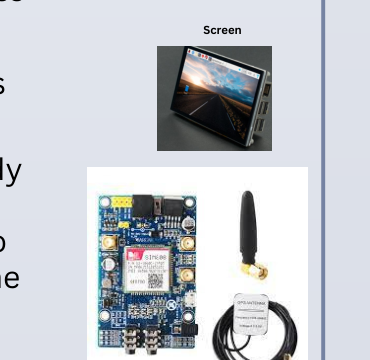
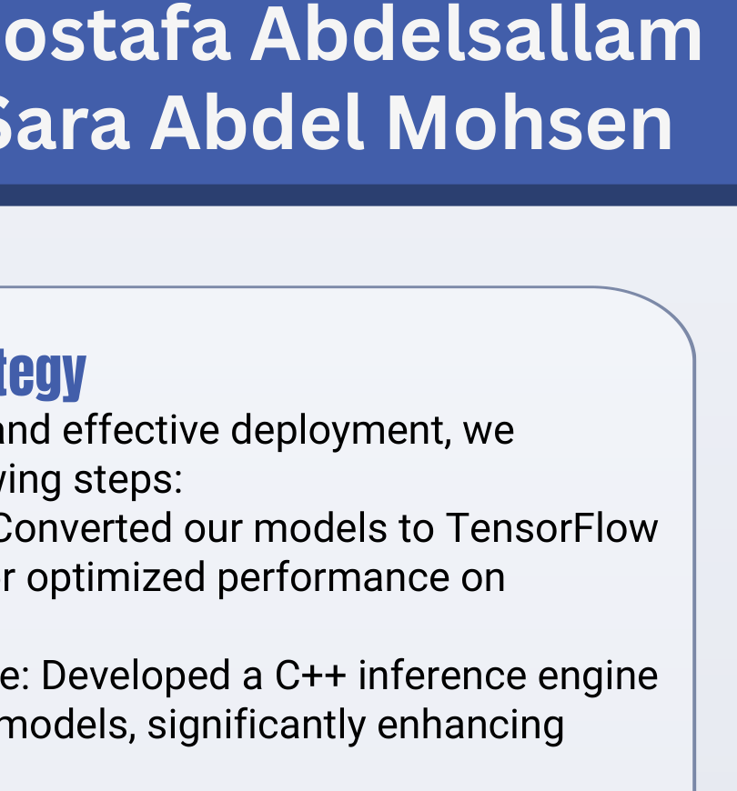
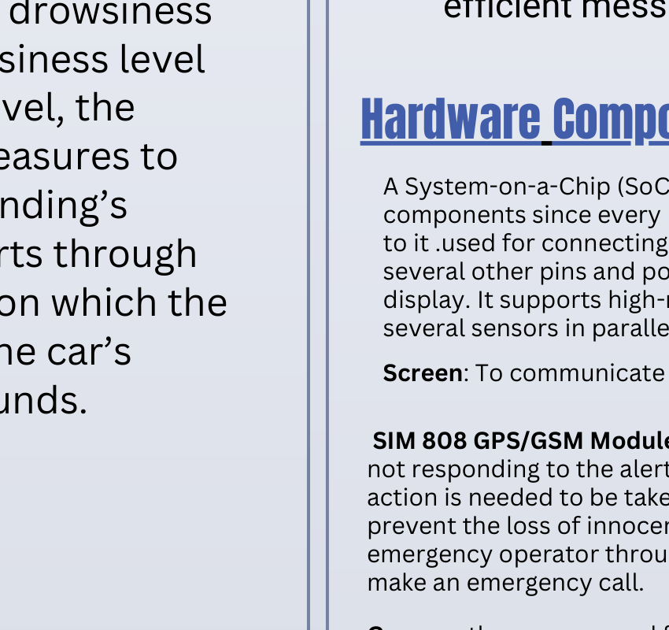
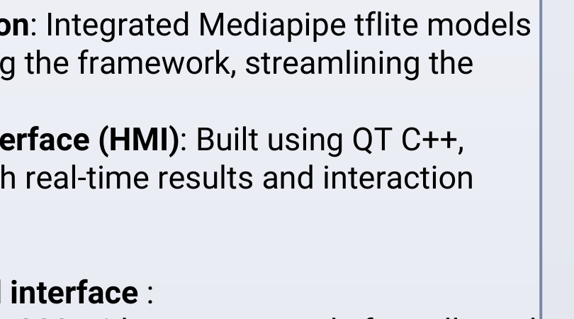
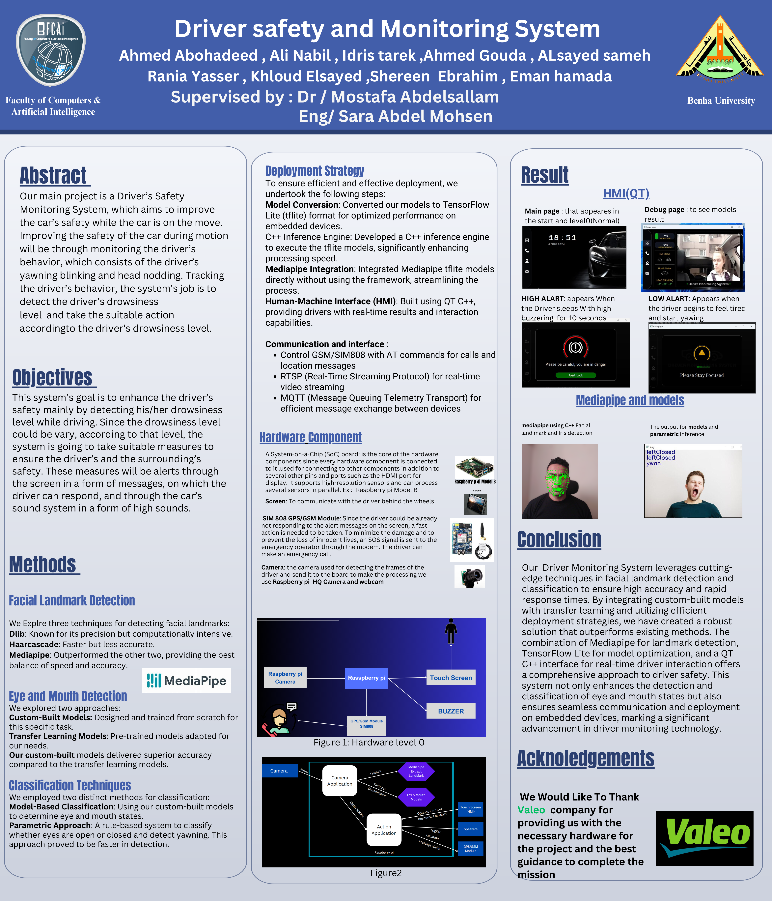

# 🚗 Driver Safety & Monitoring System

<p align="center">
  
</p>

<h1 align="center">Driver Safety & Monitoring System</h1>

<p align="center">
  <strong>Graduation Project — Faculty of Computers & Artificial Intelligence, Benha University</strong>
</p>

<p align="center">
  An embedded AI-based Driver Monitoring System designed to detect driver drowsiness in real time and trigger appropriate safety actions.
</p>

---

## 📖 The Story Behind the Project

Driving safety is not only about the vehicle itself — the driver's condition is a critical part of the safety equation.

For our graduation project, we built a **Driver Safety & Monitoring System** that continuously observes the driver's behavior while the vehicle is moving. The system focuses on visual indicators such as:

- 👁️ Eye blinking / eye closure
- 😴 Drowsiness
- 🥱 Yawning
- 🧑‍✈️ Head nodding / driver behavior

The goal was simple:

> **Detect when the driver is becoming tired or falling asleep, understand the severity of the situation, and react quickly enough to improve safety.**

Instead of building only a computer-vision model on a laptop, we focused on taking the solution toward an **embedded, real-time system**.

That meant combining AI models, computer vision, embedded hardware, communication protocols, and a driver-facing Human-Machine Interface (HMI).

---

## 🎯 Project Objectives

The system was designed to:

1. Monitor the driver's behavior in real time.
2. Detect the driver's drowsiness level.
3. Detect visual signs such as closed eyes and yawning.
4. Provide appropriate alerts according to the detected state.
5. Give the driver an interactive interface through the vehicle screen.
6. Trigger stronger safety actions when the driver does not respond.
7. Support communication through GSM/GPS.
8. Run efficiently on embedded hardware.

---

## 🧠 How the System Works

The overall pipeline can be summarized as:

```text
Driver
  ↓
Camera
  ↓
Frame Capture
  ↓
Facial Landmark Detection
  ↓
Eye / Mouth / Head Analysis
  ↓
Drowsiness Classification
  ↓
Drowsiness Level
  ↓
┌───────────────────────────────┐
│ Low Alert                     │
│ Driver is becoming tired      │
└───────────────┬───────────────┘
                ↓
          Driver Response
                │
                ├── Responds → Continue Monitoring
                │
                └── No Response
                         ↓
                  High Alert / SOS
```

The system therefore combines **perception → classification → decision → action** rather than stopping at visual detection.

---

## 👁️ Computer Vision Approach

### Facial Landmark Detection

We explored three approaches for facial landmark detection:

| Approach | Main Observation |
|---|---|
| **Dlib** | Precise, but computationally intensive |
| **Haar Cascade** | Faster, but less accurate |
| **MediaPipe** | Best balance between speed and accuracy |

After comparison, **MediaPipe** provided the most suitable balance for our real-time embedded scenario.

### Eye & Mouth Detection

We investigated two approaches:

- **Custom-built models** trained specifically for the required task.
- **Transfer learning models** adapted from pre-trained networks.

According to our project evaluation, the **custom-built models achieved better accuracy** than the transfer-learning models for our target tasks.

### Classification

We implemented two classification strategies:

#### 1. Model-Based Classification
Custom-trained models determine the state of the eyes and mouth.

#### 2. Parametric / Rule-Based Classification
A faster rule-based approach determines states such as:

- Eyes open
- Eyes closed
- Yawning

This approach was useful when fast detection was required.

---

## ⚙️ From AI Model to Embedded System

A major part of the project was not just training models — it was making them practical for an embedded environment.

### Deployment Strategy

**1. Model Conversion**

Models were converted to **TensorFlow Lite (`.tflite`)** to optimize deployment on embedded devices.

**2. C++ Inference Engine**

We developed a **C++ inference engine** to execute the TensorFlow Lite models and improve processing speed.

**3. MediaPipe Integration**

MediaPipe TensorFlow Lite models were integrated directly without relying on the full framework, helping streamline the deployment process.

**4. HMI Development**

A real-time **Human-Machine Interface was built using Qt/C++**, allowing the driver to see system results and interact with alerts.

---

## 🖥️ Human-Machine Interface

The HMI provides real-time feedback to the driver.

<p align="center">
  
</p>

### Alert Levels

#### 🟡 Low Alert

The low alert appears when the driver begins to feel tired and starts yawning.

The purpose is to warn the driver before the situation becomes critical.

#### 🔴 High Alert

The high alert appears when the system detects that the driver has fallen asleep.

A strong buzzer is activated for **10 seconds** as an immediate warning.

The system is designed around the idea of escalating the response as the driver's drowsiness level increases.

---

## 🧩 System Architecture

The project combines AI, embedded processing, HMI, and communication components.

<p align="center">
  
</p>

### Communication

The system uses several communication technologies:

- **RTSP** — real-time video streaming.
- **MQTT** — efficient message exchange between devices.
- **GSM/SIM808 AT Commands** — calls and location-related messages.

---

## 🔬 MediaPipe & Model Results

<p align="center">
  
</p>

MediaPipe was used for facial landmark and iris detection, while the project models and parametric inference were used to determine driver states.

---

## 🔌 Hardware

The embedded system is centered around a **Raspberry Pi 4 Model B**.

### Main Components

| Component | Purpose |
|---|---|
| **Raspberry Pi 4 Model B** | Main embedded processing board |
| **Camera** | Captures the driver's face and sends frames for processing |
| **Raspberry Pi HQ Camera / Webcam** | Image acquisition |
| **Touch Screen / Display** | Driver communication and HMI |
| **SIM808 GPS/GSM Module** | Emergency communication and location messages |
| **Buzzer / Car Sound System** | Audible safety alerts |

<p align="center">
  
</p>

---

## 🚨 Safety Response

The system was designed with a progressive safety response:

```text
Normal Driving
      ↓
Continuous Monitoring
      ↓
Driver Shows Signs of Fatigue
      ↓
LOW ALERT
      ↓
Does the driver respond?
   ↙          ↘
 YES           NO
  ↓             ↓
Continue     Escalate
Monitoring      ↓
             HIGH ALERT
                ↓
          Strong Buzzer
                ↓
          Emergency Action
                ↓
          GSM / GPS Support
```

The SIM808 module was included because a driver may fail to respond to an on-screen warning. In that situation, the system can support an emergency call and location messaging.

---

## 🛠️ Technology Stack

### AI & Computer Vision
- MediaPipe
- Facial Landmark Detection
- Iris Detection
- Custom-built Computer Vision Models
- Transfer Learning
- Parametric / Rule-Based Classification

### Model Deployment
- TensorFlow Lite
- C++
- C++ Inference Engine

### Embedded System
- Raspberry Pi 4 Model B
- Raspberry Pi HQ Camera
- Webcam
- Touch Screen
- SIM808 GPS/GSM Module
- Buzzer

### Communication
- RTSP
- MQTT
- GSM/GPS
- AT Commands

### User Interface
- Qt
- C++

---

## 📈 Key Engineering Decisions

One of the most important parts of the project was comparing different approaches instead of immediately choosing one technology.

### Facial Landmark Detection

```text
Dlib
  └── Accurate
      └── Computationally expensive

Haar Cascade
  └── Fast
      └── Lower accuracy

MediaPipe
  └── Good speed
      └── Good accuracy
      └── Selected for the project
```

### Classification

```text
Custom Models
  └── Better project-specific accuracy

Transfer Learning
  └── Pre-trained starting point

Parametric Approach
  └── Faster rule-based inference
```

The final solution combines these approaches according to the requirements of real-time embedded operation.

---

## 🏗️ Project Development Journey

### Phase 1 — Problem Definition
We identified driver drowsiness as the main safety problem and defined the behaviors the system needed to monitor.

### Phase 2 — Computer Vision Research
We evaluated different facial landmark techniques and compared Dlib, Haar Cascade, and MediaPipe.

### Phase 3 — Model Development
We explored custom-built models and transfer-learning models for eye and mouth detection.

### Phase 4 — Fast Classification
We introduced a parametric approach to provide faster detection for relevant driver states.

### Phase 5 — Embedded Deployment
The models were converted to TensorFlow Lite and integrated into a C++ inference pipeline.

### Phase 6 — Real-Time HMI
We developed a Qt/C++ interface to display the driver's status and safety alerts.

### Phase 7 — Communication & Safety
RTSP, MQTT, and GSM/GPS communication were integrated to connect the different system components and support emergency actions.

### Phase 8 — System Integration
Finally, the AI models, Raspberry Pi, cameras, display, buzzer, and GSM/GPS module were combined into one Driver Monitoring System.

---

## 🎓 Graduation Project

**Project:** Driver Safety and Monitoring System

**Institution:** Faculty of Computers & Artificial Intelligence, Benha University

**Supervised by:**
- Dr. Mostafa Abdelsallam
- Eng. Sara Abdel Mohsen

### 👥 Team

- Ahmed Abohadeed
- Ali Nabil
- Idris Tarek
- Ahmed Gouda
- Alsayed Sameh
- Rania Yasser
- Khloud Elsayed
- Shereen Ebrahim
- Eman Hamada

---

## 🤝 Valeo Support

We would like to thank **Valeo** for providing the necessary hardware for the project and for the guidance that helped us complete the project.

This support was an important part of moving the project beyond a software prototype toward an **embedded automotive-oriented system**.

<p align="center">
  
</p>

---

## 📸 Project Poster

<p align="center">
  
</p>

---

## 🧾 Conclusion

The Driver Safety & Monitoring System demonstrates how **AI and computer vision can be combined with embedded systems to address a real-world automotive safety problem**.

The project brings together:

- Facial landmark detection
- Iris detection
- Eye and mouth state recognition
- Drowsiness classification
- TensorFlow Lite deployment
- C++ inference
- MediaPipe
- Raspberry Pi
- Qt/C++ HMI
- RTSP
- MQTT
- GSM/GPS communication
- Real-time safety alerts

The most important lesson from the project was that building an AI system for a real environment requires more than a high-performing model. **The model must also be optimized, deployed, connected to hardware, integrated with a user interface, and capable of producing an appropriate action in real time.**

---

## ⭐ Project Highlight

> **From facial landmarks to real-time safety action — our project connects AI, embedded systems, and automotive safety into one integrated Driver Monitoring System.**

